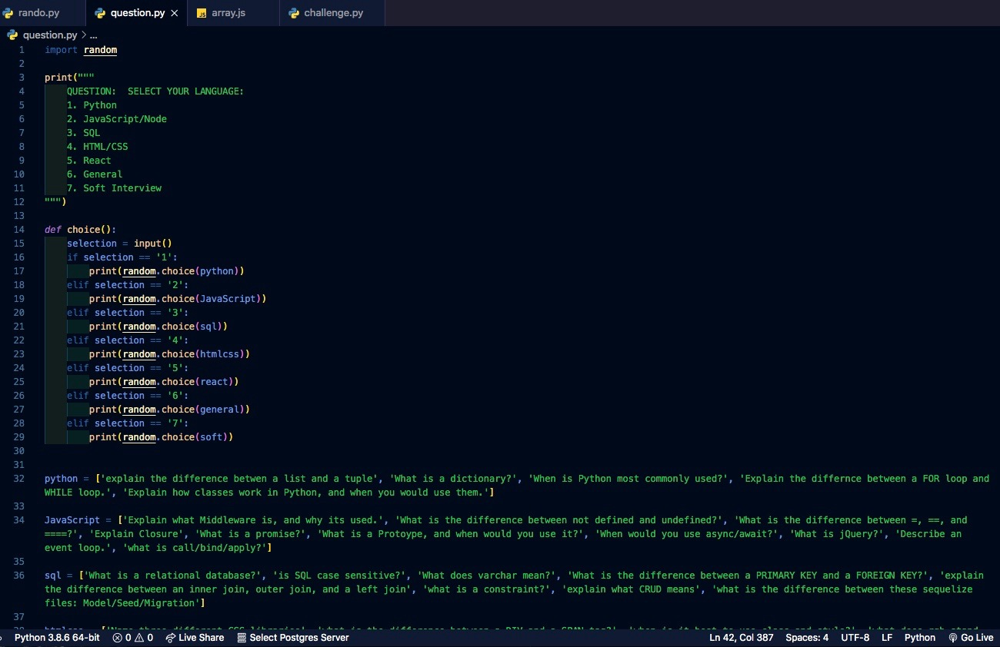

# PythonStudyGroup

Program written to help guide a weekend study group among classmates in DC NOV 2020 Cohort.  Randomizes names, then allows to pick from a challenge or question in various languages to help prepare for soft/technical interviews.

 
